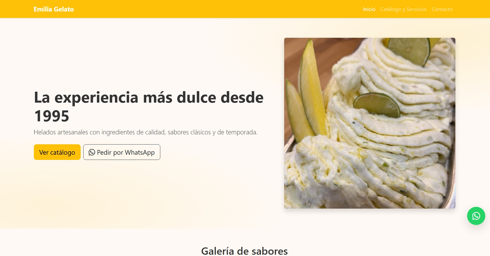

# 🍦 Emilia Gelato – Sitio Web  

Proyecto final del curso **Desarrollo Web (Técnico Laboral en Software)**.  
Se trata de una aplicación web para una heladería, desarrollada con la metodología **Scrum**, aplicando buenas prácticas de **HTML5, CSS3, JavaScript** y **Bootstrap 5**.  

  

---

## 🚀 Características principales  
- Catálogo digital de sabores con imágenes y precios.  
- Botón flotante de **WhatsApp** para pedidos rápidos.  
- Página de **servicios** (domicilios, catering, heladería móvil).  
- Página de **contacto** con formulario validado y mapa de ubicación.  
- Diseño **responsivo** y accesible (funciona en móvil, tablet y PC).  
- Optimización SEO básica (meta tags, Open Graph y JSON-LD).  
- Gestión del proyecto con **Scrum** → Trello para backlog y sprints.  

---

## 🛠️ Tecnologías usadas  
- **HTML5** – estructura semántica.  
- **CSS3** + **Bootstrap 5** – estilos y diseño responsivo.  
- **JavaScript (Vanilla)** – validaciones, filtros y mejoras UX.  
- **Figma** – bocetos UI.  
- **Lucidchart** – diagramas UML.  
- **Trello** – gestión de tareas y sprints.  

---
